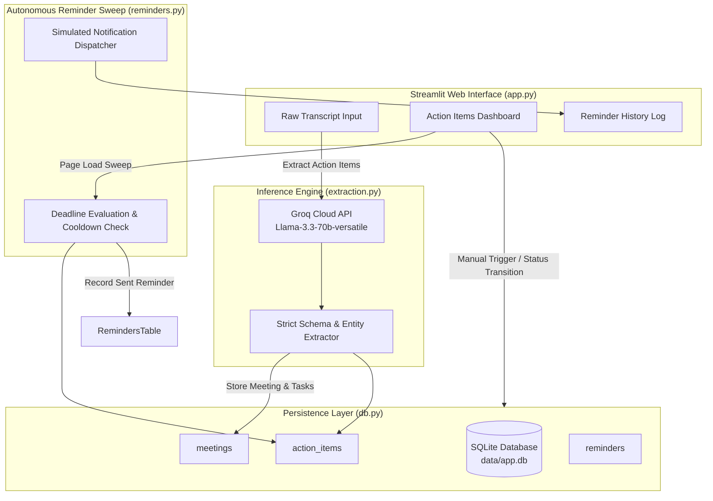

# AI Meeting & Follow-Up Agent

An autonomous meeting intelligence agent that extracts decisions and action items from transcripts, assigns owners and deadlines, and operates an automated follow-up lifecycle.

[](https://github.com/daanialmirza5/ai-meeting-followup-agent/actions/workflows/ci.yml)
[](https://python.org)
[](https://streamlit.io)
[](https://groq.com)
[](LICENSE)

*Built for InnovaHack Chapter 1 — Agentic AI Track (Problem Statement 2: Meeting Intelligence & Autonomous Action Item Tracking).*

---

## Overview

In collaborative teams, meetings often generate high-value decisions and action items that get lost in unstructured notes or unread docs. Manual follow-up is tedious and inconsistent.

The **AI Meeting & Follow-Up Agent** provides a lightweight, automated system:
1. **Intelligent Ingestion**: Ingests raw meeting transcripts (dialogue, rough notes, or speaker transcripts).
2. **Structured Extraction**: Leverages Groq's high-speed inference on `llama-3.3-70b-versatile` with strict JSON mode to parse concrete tasks, underlying decisions, assignees, and target deadlines.
3. **Persistent Tracking**: Persists meeting records, action items, and audit trails in SQLite.
4. **Autonomous Follow-Up Engine**: Executes deadline-driven sweeps on session initialization to identify overdue or approaching commitments, logging simulated reminders with built-in cooldowns and manual dispatch triggers.

---

## System Architecture



---

## Key Features

- **High-Speed Zero-Shot Extraction**: Structured JSON extraction powered by Groq Llama 3.3 70B.
- **Explainable Decision Tracking**: Links every action item back to its underlying rationale and parent meeting context.
- **Kanban-Style Status Lifecycle**: Seamless transition between *Pending* and *Completed* states with instant reopen capability.
- **Autonomous Follow-Up Engine**: Deterministic date parsing evaluates overdue tasks against UTC timestamps, respecting a 20-hour anti-spam cooldown.
- **Complete Audit Trail**: Detailed timestamped history for every automated and manual follow-up notification.

---

## Tech Stack

- **Frontend / UI**: Streamlit 1.38+
- **LLM Provider**: Groq API (`llama-3.3-70b-versatile` or OpenAI-compatible endpoint)
- **Database**: SQLite (Local embedded storage with schema auto-initialization)
- **Date Parsing & Logic**: `python-dateutil` with fallback parsing
- **Testing**: Python `unittest` & `pytest`
- **CI/CD**: GitHub Actions

---

## Project Structure

```text
ai-meeting-followup-agent/
├── .github/
│   └── workflows/
│       └── ci.yml               # Automated CI pipeline
├── .streamlit/
│   └── secrets.toml.example     # Template for Streamlit secrets
├── tests/
│   └── test_meeting_agent.py    # Unit tests for DB, reminders & parsing
├── app.py                       # Main Streamlit web application & UI
├── db.py                        # SQLite schema & persistence helpers
├── extraction.py                # Groq LLM integration and JSON extractor
├── reminders.py                 # Autonomous reminder engine & date evaluator
├── requirements.txt             # Project dependencies
├── .env.example                 # Environment configuration template
├── LICENSE                      # MIT License
└── README.md
```

---

## Installation & Local Setup

### 1. Prerequisites
- Python 3.10+ (tested on Python 3.11 and 3.12)
- Groq API key ([console.groq.com](https://console.groq.com/keys) - free tier available)

### 2. Clone & Install Dependencies
```bash
git clone https://github.com/daanialmirza5/ai-meeting-followup-agent.git
cd ai-meeting-followup-agent

# Create and activate a virtual environment
python -m venv .venv
source .venv/bin/activate  # On Windows: .venv\Scripts\activate

# Install requirements
pip install -r requirements.txt
```

### 3. Configure API Credentials
Create a `.env` file or `.streamlit/secrets.toml`:
```bash
cp .env.example .env
```
Add your Groq API key:
```ini
GROQ_API_KEY="gsk_your_groq_api_key_here"
GROQ_MODEL="llama-3.3-70b-versatile"
```

### 4. Run the Application
```bash
streamlit run app.py
```
Open [http://localhost:8501](http://localhost:8501) in your browser.

---

## Running Tests

Execute the automated test suite locally:

```bash
# Using standard library unittest
python -m unittest discover -s tests -p "test_*.py"

# Or using pytest
pytest tests/
```

---

## Deployment (Streamlit Community Cloud)

1. Fork or push this repository to GitHub.
2. Visit [share.streamlit.io](https://share.streamlit.io/) and create a **New App**.
3. Select this repository and set the main file path to `app.py`.
4. In **Advanced Settings > Secrets**, add:
   ```toml
   GROQ_API_KEY = "gsk_your_groq_api_key_here"
   ```
5. Click **Deploy**.

---

## License

This project is licensed under the [MIT License](LICENSE).
